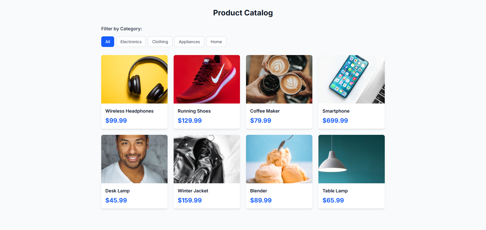

# Product Catalog

A modern, responsive product catalog built with Next.js and Tailwind CSS.



## 📱 Live Demo

[Check out Live Demo](https://product-catalog-rho-drab.vercel.app/)

## 🚀 Features

- **Category Filtering**: Filter products by Electronics, Clothing, Appliances, and Home
- **Modern UI**: Clean interface with Tailwind CSS
- **Fast Performance**: Built with Next.js for optimal speed
- **Interactive**: Hover effects and smooth transitions

## 🛠️ Technologies Used

- **Next.js 14** - React framework
- **Tailwind CSS** - Utility-first CSS framework
- **React Hooks** - useState and useEffect for state management

## 🏃‍♂️ Getting Started

### Prerequisites
- Node.js 18+
- npm or yarn

### Installation

1. Clone the repository:
```bash
git clone https://github.com/ashiknizamdeen/product-catalog.git
cd product-catalog
